# 📘 Smart Diary Web Application

## 📌 Overview

Smart Diary is a web-based application designed to help users record, manage, and analyze their daily thoughts, activities, and moods in a secure and organized way. It provides a modern digital alternative to traditional diaries with additional smart features like reminders, analytics, and calendar-based tracking.

---

## 🚀 Features

* 🔐 User Registration & Login System
* 📝 Create, Edit, and Delete Diary Entries
* 📅 Calendar View for tracking entries
* 😊 Mood Tracking and Analysis
* 🔔 Reminder & Notification System
* 📂 Organized entries by date
* 🎨 Responsive and user-friendly interface

---

## 🛠️ Technologies Used

| Layer    | Technology           |
| -------- | -------------------  |
| Frontend | HTML, CSS, JavaScript|
| Backend  | PHP                  |
| Database | MySQL                |

---


## ⚙️ Installation & Setup

### 🔹 Step 1: Clone Repository

```bash
git clone https://github.com/your-username/smart-diary.git
```

### 🔹 Step 2: Move to WAMP Directory

Copy project folder to:

```
C:\wamp64\www\
```

---

### 🔹 Step 3: Create Database

1. Open **phpMyAdmin**
2. Create database:

```
smart_diary
```

---

### 🔹 Step 4: Import Database

* Go to Import tab
* Upload `smart_diary.sql` file

📁 Database file included in this repository:
[Download Database](smart_diary.sql)

---

### 🔹 Step 5: Configure Database Connection

Update your `config.php`:

```php
$servername = "localhost";
$username = "root";
$password = "";
$dbname = "smart_diary";
```

---

### 🔹 Step 6: Run the Project

Open browser:

```
http://localhost/smart-diary
```

---

## 📊 Database Tables

* users
* diary_entries
* reminders
* notifications
* mood_logs

---

## 📸 Screenshots
✨ Landing Page

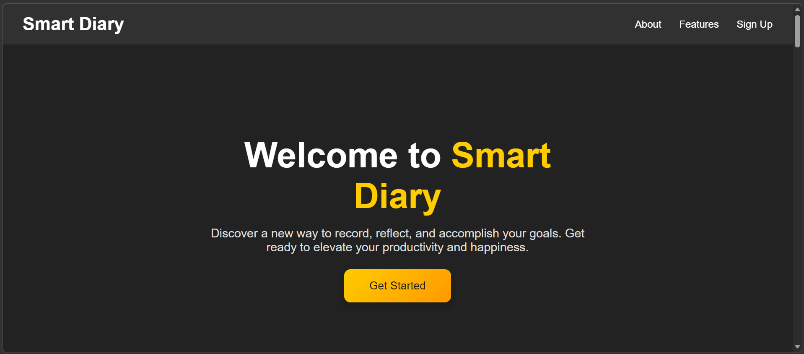
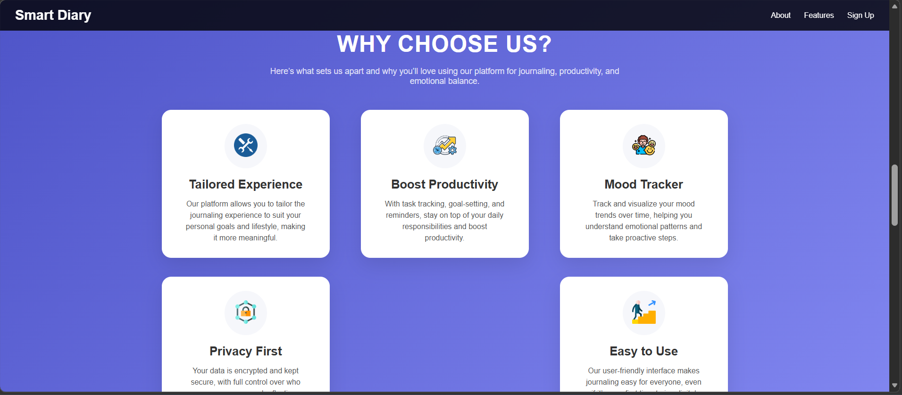
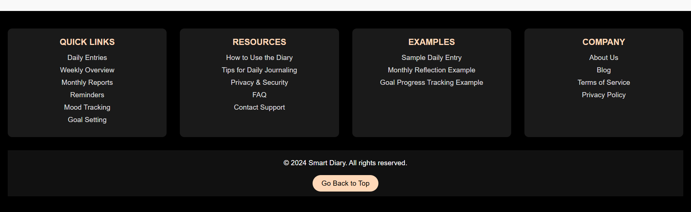

---

🔐 User Login

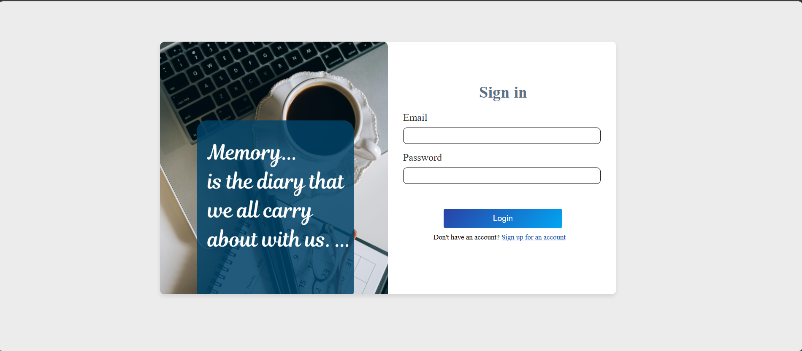

---
🔐 User Registration


---
📋 Home Page

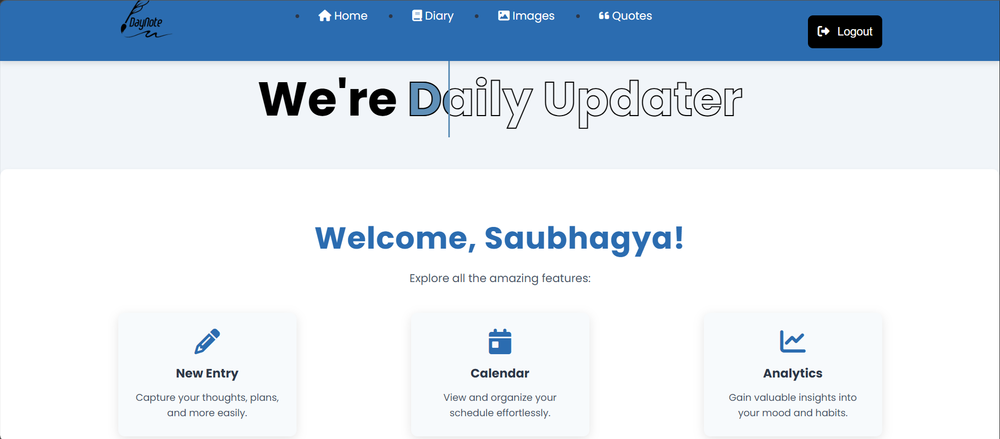
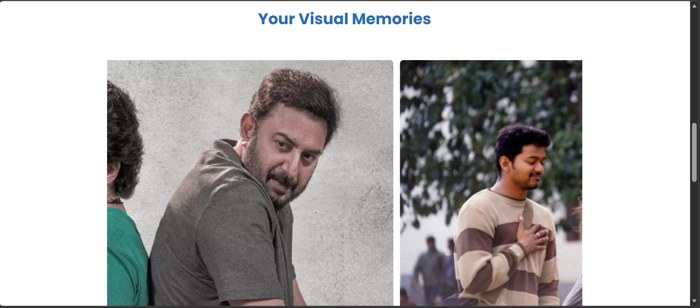
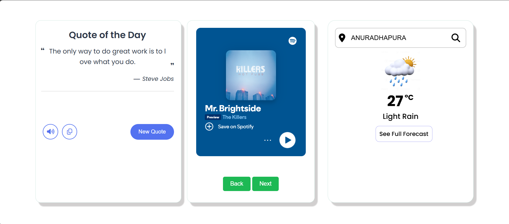
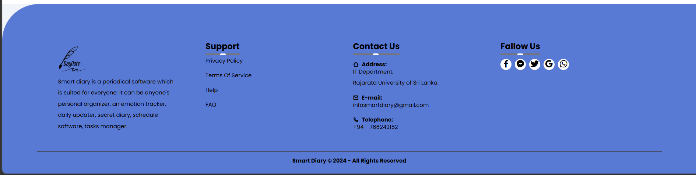

---
📊 Features

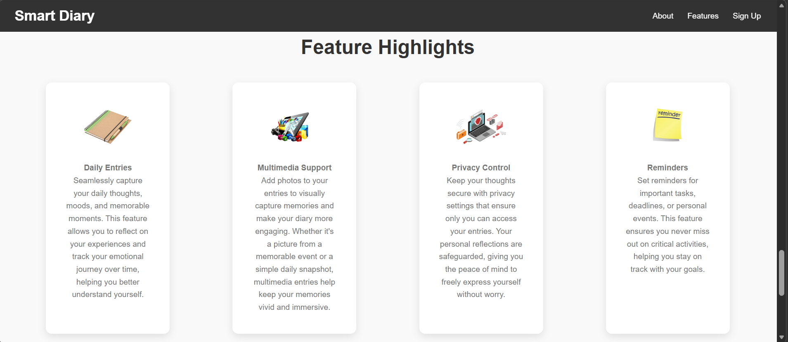
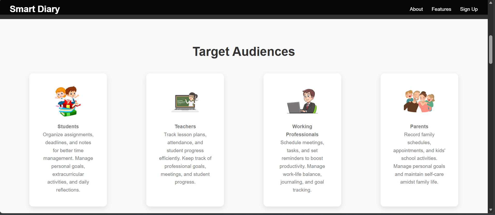

---
📍 New Entry

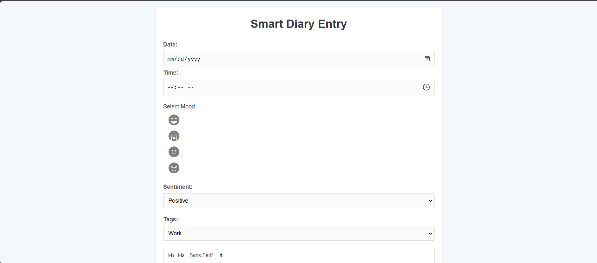
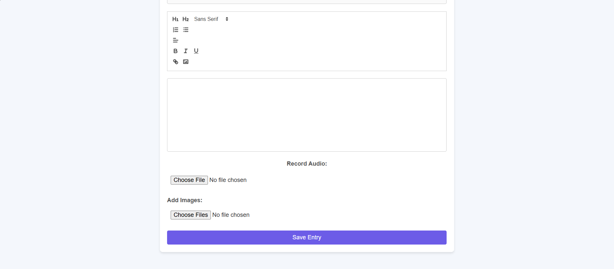

---
🧾 calendar

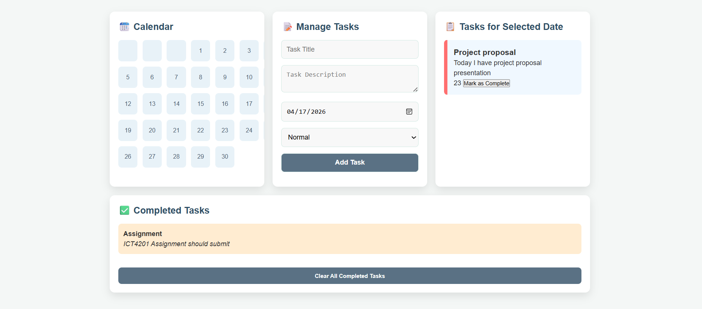

---
🧾 Weather

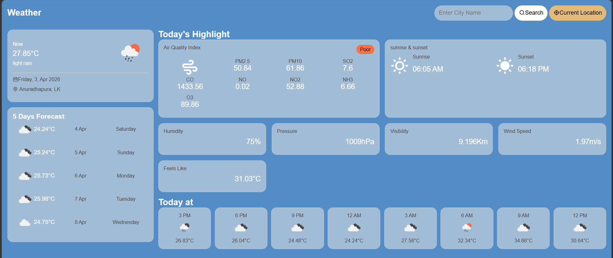

---
🛠️ Setting

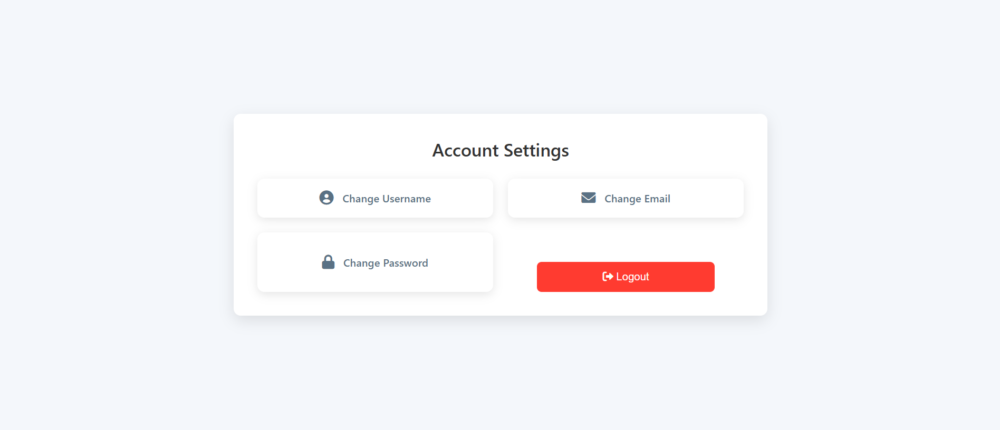

---

## 🎥 Project Demo
Experience the Smart Diary application in action:

👉 [Watch Full Demo Video](https://drive.google.com/file/d/1IRlWk7oE33aw43eQTiq_D8SulKyog4Ot/view?usp=sharing)

---

## 🎯 Project Objectives

* Provide a digital platform for personal diary writing
* Enable mood tracking and analysis
* Improve productivity with reminders
* Ensure secure and private data management

---

## ⚡ Future Improvements

* Mobile app version
* AI-based mood prediction
* Cloud synchronization
* Push notifications

---


## 🧠 What I Learned

* Web-Application development using HTML,CSS & JavaScript
* Database integration with MySQL
* Authentication & state management

---

## 👨‍💻 Author

**Saubhagya**
🎓 Undergraduate IT Student
💻 Full Stack Developer

---

## 🌟 Support

If you like this project, give it a ⭐ on GitHub 🚀
